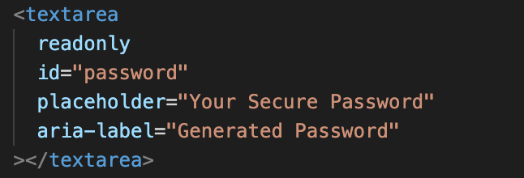

# Password Generator
**Project Description:** 
  Creating a Password Generator using JavaScript that enables employees to generate random passwords based on criteria that they’ve selected.

## User Story

```
AS AN employee with access to sensitive data
I WANT to randomly generate a password that meets certain criteria
SO THAT I can create a strong password that provides greater security
```

## Acceptance Criteria

```
GIVEN I need a new, secure password
WHEN I click the button to generate a password
THEN I am presented with a series of prompts for password criteria
WHEN prompted for password criteria
THEN I select which criteria to include in the password
WHEN prompted for the length of the password
THEN I choose a length of at least 8 characters and no more than 128 characters
WHEN prompted for character types to include in the password
THEN I choose lowercase, uppercase, numeric, and/or special characters
WHEN I answer each prompt
THEN my input should be validated and at least one character type should be selected
WHEN all prompts are answered
THEN a password is generated that matches the selected criteria
WHEN the password is generated
THEN the password is either displayed in an alert or written to the page
```

## End-Result Functionality

The following gif shows the web application's appearance and functionality:


## Starter Script Code

The following photo shows the starter script code that was given to build off of:


## The Process

The starting script code already had the generateBtn element with the addEventListener method. What this is doing is initiating the WritePassword function once the "generate" button is clicked. It does this by creating a variable generateBtn and setting it equal to document.querySelector("#generate") which is essentially attaching it to the id=generate in the html code which is shown below:


So to start off, we needed to add prompts that would come up when the user clicked the generate button. There were many ways in which to execute this, but in this case, a new function called Prompt was added to contain the prompt of whether or not the user wanted to create a password or not. if the user typed "yes", a variable named password was set equal to another new function called generatePassword (which we will get into later), via an if statement. After that, the writePassword function is called within the Prompt function. Below you can see the Prompt function structure, and the adjustments to the writePassword function:


So, as mentioned previously, if the user types "yes" for creating a password, the generatePassword function is called. This is where all of the different password properties are handled and the actual password creation itself takes place.

The first thing that takes place in the generatePassword function is the password Length initializing. A variable for passLength is created and set to the boolean of false. Then, within a while loop, the user is then prompted for the length they would like the password to be, which is pointed to by the passwordLength variable. ParseInt is used to ensure that if the user types a decimal number, a whole number is returned. The purpose of the while loop is to make sure the user is continuosly asked about the password length until they give a value between 8 and 128. If they give an invalid number, they are given an alert via an alert function. If and when the user enters a valid number for the password length, passLength is set to true, so that the while loop ends since the while loop will run as long as the passLength is false. See below for the actual structure of the script for this portion:


From here, we then cerate the variables for the different types of properties the password can have: special characters, uppercase letters, lowercase letters, and numbers (characters, uppercase, lowercase, and Numbers). These variables point to arrays that contain string properties. And then the prompts for if the user wnats these individual properties included in their password is added and set to numbConfirm, charConfirm, upperConfirm, and lowerConfirm. If the user clicks "OK" these variables are pointing to a boolean of true, and false if the user clicks "cancel".


The next portion of the generatePassword function is using the password length the user indicated, and actually putting the paossword together. To start, a variable called "output" is created that will store the password as the while loop is working. The initial while loop has the statement of "output.length < passwordLength" which is making sure the while loop continues as long as the output being generated has a length less than the length the user wants the password to be. Within the while loop itself, we have four if statements, one for each of the different password properties. 

Each if statement checks to see if the numbConfirm, charConfirm, upperConfirm, or lowerConfirm are true, meaning the user wants them in the password, and then it also checks to make sure the outputLength is still less than the passwordLength the user wanted. If both of these statements are true, the if statement runs. To add the number, uppercase letter, lowercase letter, or character to the output, we use output.push followed by "Numbers[Math.floor(Math.random() * Numbers.length)]" (note this is for the Numbers variable indicated by "Numbers" in the front of this statement). What this is doing is randomizing which number is selected from the Numbers array based on the length of the array itself. Once that randon number is selected, it pushes it onto the end of the output variable. 


This repeats for each different property of the password in the same manner as seen in the above screenshot. Note that is the user did not one of the variables (uppercase, lowercase, characters, or numbers), the if statement would not run to avoid adding those items to the password. 

After the while loop is done based on if the output length is less than the length indicated by the user, we turn this output array contianing the password into a string by using output.join(") and setting it equal to the variable passwordOutput. Password Output now points to the password string generated by the while loop. Then, we "return" passwordOutput so that this is what is returned once this generatePassword function is complete and so that it can be used in other functions if the generatePassword is called out (as it is in the Prompt function.)


Now, if we look back up to the Prompt function, we see that the variable password is set equal to the generatePassword function. So now, the password variable points to the string returned by the generate Password function. And if looking at the Prompt photo, we can see that within the prompt function at the very end (outside of the if statement), writePassword is called and it contains the password. So now, the write Password function will run. This is where the querySelector is used to reference the selector of the password ID in the html and sets it equal to the variable passwordText: 



The passwordText variable is then set equal to the password itself generated from the generatePassword function, and passed on from the Prompt function:


This is how the actual password we generated is able to be shown on the webpage after it is created. 


## Credits

CSS Tricks - [Select Random Item from an Array](https://css-tricks.com/snippets/javascript/select-random-item-array/ "Array Randomize")

W3Schools - [JavaScript Popup Boxes](https://www.w3schools.com/js/js_popup.asp)

MDN Web Docs - [Document.querySelector](https://developer.mozilla.org/en-US/docs/Web/API/Document/querySelectorAll)

W3Shools - [JavaScript DOM Event Listeners](https://www.w3schools.com/js/js_htmldom_eventlistener.asp)

MDN Web Docs - [parseInt() - JavaScript](https://developer.mozilla.org/en-US/docs/Web/JavaScript/Reference/Global_Objects/parseInt)

W3Schools - [JavaScript Array Reference](https://www.w3schools.com/jsref/jsref_obj_array.asp)


## Links

GitHub Repository - [Generator Repository](https://github.com/ktrudickm/PasswordGenerator "Generator Repository")

Deployed Project - [Deployed Application]( "Deployed Application")